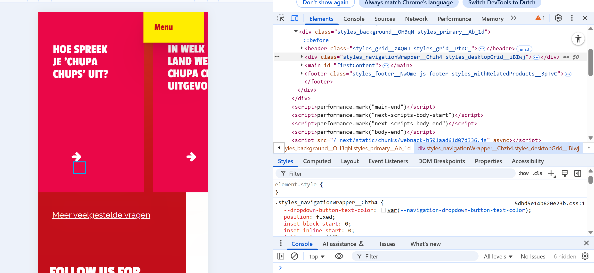

# Procesverslag
Markdown is een simpele manier om HTML te schrijven.  
Markdown cheat cheet: [Hulp bij het schrijven van Markdown](https://github.com/adam-p/markdown-here/wiki/Markdown-Cheatsheet).

Nb. De standaardstructuur en de spartaanse opmaak van de README.md zijn helemaal prima. Het gaat om de inhoud van je procesverslag. Besteedt de tijd voor pracht en praal aan je website.

Nb. Door *open* toe te voegen aan een *details* element kun je deze standaard open zetten. Fijn om dat steeds voor de relevante stuk(ken) te doen.

## Jij

  
uitwerken voor kick-off werkgroep

  ### Auteur:
  Nour Raian

  #### mijn startniveau:
  rood óf blauw=paars 

  #### mijn focus:
  Responsive
 

## mijn website

  
uitwerken voor kick-off werkgroep

  ### mijn opdracht:
  (https://www.chupachups.nl/)/De Chupa Chups-website heeft een vrolijke en kleurrijke uitstraling met felle tinten die passen bij de bekende lolly’s. Bezoekers vinden er informatie over smaken, geschiedenis en acties. De stijl is speels en gericht op plezier.

  #### Screenshot(s) van de eerste pagina (small screen): 
  Chupachups 
   Deze Chupa Chups-pagina heeft een speelse en kleurrijke vormgeving met de merk­kleuren rood en geel. Links staat een grote afbeelding van een lachende vrouw met een lolly, wat de vrolijke sfeer benadrukt. Rechtsboven bevindt zich een navigatiemenu met opties zoals Producten, Nieuws, Geschiedenis en FAQ. In het midden staat de opvallende slogan “FOREVER FUN!”, vergezeld van een korte tekst over de meer dan 100 smaken. Onderaan staat een gele call-to-action knop “ONTDEK MEER” die de gebruiker uitnodigt verder te klikken.

  #### Screenshot(s) van de tweede pagina (small screen):
  Chupachups 
   Deze productpagina van Chupa Chups heeft een frisse en speelse opmaak met de merk­kleuren roze, geel en wit. Links staat een grote productafbeelding van de Melody Pops-lolly’s, die meebeweegt tijdens het scrollen (parallax-effect). Rechts staat een witte contentbox met de productnaam Melody Pops, een korte beschrijving en aanvullende informatie over ingrediënten en allergenen. Onderaan in de box bevindt zich een opvallende gele knop met “KOPEN” als call-to-action, naast een link naar meer productinformatie. Bovenaan blijft het logo en menu zichtbaar voor navigatie.
 

## Toegankelijkheidstest 1/2 (week 1)

  
uitwerken na test in 2e werkgroep

  ### Bevindingen
  Lijst met je bevindingen die in de test naar voren kwamen:
   die bovenste lijn in de top van pagina wordt door de verteller als regel gelezen.Een screenreader-gebruiker verwacht alleen nuttige inhoud

   Het beeld van de lachende vrouw met een lolly wordt niet automatisch beschreven door de verteller tenzij er een alt-tekst is toegevoegd

   De decoratieve cirkel (wit rondje rechts van de tekst “LOLLY’S”) wordt door de screenreader voorgelezen alsof het een betekenisvol element is.Voor gebruikers die blind of slechtziend zijn, geeft dat ruis en verwarring: ze horen iets wat eigenlijk geen inhoudelijke waarde heeft
  
   Dit element heeft geen betekenis voor de gebruiker, maar wordt toch voorgelezen door de screenreader.

   Decoratieve blokken/figuren horen genegeerd te worden,want ze dragen niets bij aan de inhoud.

   Onnodige tab-stops, rommelige leesvolgorde, visuele focus springt naar grote containers.

  Screenreaders zien dit pijl als afbeelding. Blinde gebruikers krijgen dus niet door dat dit bedoeld is om naar een antwoord te navigeren

  Afbeelding wordt voorgelezen, Titel THE BEST OF WHEEL 200ST wordt netjes gelezen en Knop TOON PRODUCT wordt ook gelezen als actie.

   van dit pagina is dat de enige wat wordt voorgelezen en verder niks meer

   De screenreader negeert dit tabel.

  De screenreader geeft aan dat er geen actiesknoppen zijn in dit pagina terwijl er wel is. Deze knop werkt met de muis, maar is technisch geen knop. Voor screenreaders wordt hij niet als actie herkend, waardoor blinde gebruikers de actie niet kunnen uitvoeren.

## Breakdownschets (week 1)

  
uitwerken na afloop 3e werkgroep

  ### de hele pagina: 
  
  

  ### dynamisch deel (menu): 
  

  ### wellicht nog een dynamisch deel (slide-in effect en Visueel hover-effect wanneer de muis over een product beweegt product die mee beweegt bij het scrollen ): 
  
  
  
  

## Voortgang 1 (week 2)

  
uitwerken voor 1e voortgang

  ### Stand van zaken
  **Wat ging goed:** Ik ben gelukkig gelijk begonnen met het maken van HTML en CSS, omdat de docent had gezegd dat we het anders niet zouden redden. Hierdoor had ik al snel een begin gemaakt. 
  **Wat was lastig:** Het kiezen van een website vond ik lastig. Ik ben niet zo bevorderd in code en heb toch een best uitdagende website gekozen en heb besloten om die responsief te maken. Daarnaast had ik wat structuur fout in mijn HTML, maar die heb ik met hulp van medestudenten en de docent kunnen oplossen.  
  Over het algemeen was de eerste opzet van HTML goed te doen.
  
   

  ### Agenda voor meeting
  samen met je groepje opstellen

  | student 1      | student 2          | student 3    | student 4        |
  | ---            | ---                | ---          | ---              |
  | dit bespreken  | en dit             | en ik dit    | en dan ik dat    |
  | en dat ook nog | dit als er tijd is | nog een punt | dit wil ik zeker |
  | ...            | ...                | ...          | ...              |

  ### Verslag van meeting
  hier na afloop snel de uitkomsten van de meeting vastleggen:

Tijdens het feedbackmoment had ik mijn breakdownschets laten zien en hoe ik mijn structuur wilde opbouwen ik had toen ook al wat HTML gecodeerd.  
Ik kreeg waardevolle feedback van de studentassistent over mijn HTML-structuur: bepaalde dingen konden netter of anders.  
Na afloop heb ik de feedback die ik genoteerd had verwerkt in mijn HTML-structuur zodat die netter werd.  
Ik had toen ook een breakdownschets van een pagina gemaakt en kreeg het advies om dit ook voor de tweede pagina te doen. Dat heb ik gedaan, en daardoor kreeg ik meer inzicht in hoe ik die tweede pagina zou opbouwen.

## Voortgang 2 (week 3)

  
uitwerken voor 2e voortgang

 ### Stand van zaken
**Wat ging goed:** Ik heb de opzet van pagina 1 en pagina 2 al af kunnen maken, zodat ik verder kon werken in CSS.  
**Wat was lastig:** Ik had weinig CSS vergeleken met andere studenten.
Dat gaf wat stress, zeker omdat ik ook een week ziek was geweest en daardoor achterstand had.  

  ### Agenda voor meeting
  samen met je groepje opstellen

  | student 1      | student 2          | student 3    | student 4        |
  | ---            | ---                | ---          | ---              |
  | dit bespreken  | en dit             | en ik dit    | en dan ik dat    |
  | en dat ook nog | dit als er tijd is | nog een punt | dit wil ik zeker |
  | ...            | ...                | ...          | ...              |

  ### Verslag van meeting
  Tijdens het feedbackmoment kreeg ik van de docent de tip om in plaats van `<button>` een `<a>` te gebruiken en die met CSS als button te stijlen.  
  De docent stelde me ook gerust dat ik nog goed op weg was en dat het in orde zou komen.  
  Na afloop van de meeting heb ik direct aanpassingen doorgevoerd en de stijling verbeterd.  

## Toegankelijkheidstest 2/2 (week 4)

  
uitwerken na test in 9e werkgroep

  ### Bevindingen
  **Voedingswaardentabellen**  
    In de originele site werden tabellen niet gelezen door de screenreader.  
    In mijn versie worden ze wel correct voorgelezen.  
    
    
    

  **Supermarkten (koop-opties)**  
    In de originele site werden deze blokken genegeerd door de screenreader.  
    In mijn versie zijn er alt-teksten toegevoegd waardoor de screenreader de namen van de supermarkten goed kan voorlezen.  
    

**Productinformatie**  
    Oorspronkelijk las de screenreader alleen de productnaam voor.  
    In mijn versie wordt de volledige productinformatie ook uitgesproken.  
    

**Navigatie (menu)**  
    Het navigatiemenu is nu goed gestructureerd en volledig verstaanbaar voor de screenreader.  
    

**Decoratieve elementen**  
    Elementen die puur decoratief zijn, heb ik verborgen voor screenreaders (`alt=""`).  
    In de originele site werden deze wel voorgelezen, wat verwarrend was voor slechtziende gebruikers.  
    
    

**Breadcrumbs**  
    Breadcrumbs zijn nu in een `<nav aria-label="breadcrumb">` geplaatst.  
    De screenreader kondigt dit correct aan als navigatie, waardoor gebruikers beter begrijpen waar ze zich bevinden.  
    

## Voortgang 3 (week 4)

  
uitwerken voor 3e voortgang

  ### Stand van zaken
  hier dit ging goed & dit was lastig (neem ook screenshots op van delen van je website en code)

  ### Agenda voor meeting
  samen met je groepje opstellen

  | student 1      | student 2          | student 3    | student 4        |
  | ---            | ---                | ---          | ---              |
  | dit bespreken  | en dit             | en ik dit    | en dan ik dat    |
  | en dat ook nog | dit als er tijd is | nog een punt | dit wil ik zeker |
  | ...            | ...                | ...          | ...              |

  ### Verslag van meeting
  hier na afloop snel de uitkomsten van de meeting vastleggen

  ## Voortgang 3 (week 4)

  
uitwerken voor 3e voortgang

  ### Stand van zaken
  ## Voortgang 3 (week 4)

  
uitwerken voor 3e voortgang

  ### Stand van zaken
  **Wat ging goed:** De mobile-first versie van de 1e pagina is af en de header is een klein beetje responsief. Als ik problemen had in mijn CSS, werd ik steeds geholpen door de docent en de studentenassistent.
  **Wat was lastig:** CSS voelde verwarrend omdat ik meer dan 10 `<section>`s heb en ik mijn HTML puur semantisch wil houden. Met al die `:nth-of-type` herhalingen werd het snel onoverzichtelijk.

  ### Verslag van meeting
  Ik kreeg tijdens het feedbackmoment de tip om in een bepaalde sectie een **button met h3** te maken, omdat ik een lange pagina met veel `<h2>` had.
   
  Na de feedback heb ik dat aangepast. Eerst leek alles goed (geen errors), maar na het stylen van de 1e pagina kreeg ik ineens **6 errors**.
  
  Er werd tegen mij gezegd dat **`<h3>` en `<button>` niet met elkaar mogen**. Dat heb ik vervolgens opgelost.
  Wat ik vooral moeilijk vond: werken met **`@media`**, omdat in combinatie met **`:nth-of-type`** dingen vaak misgingen.

## Eindgesprek (week 5)

  
uitwerken voor eindgesprek

  ### Je uitkomst - karakteristiek screenshots:
  
  
  
  

  ### Dit ging goed/Heb ik geleerd: 
  De voedingswaardentabel wordt goed weergegeven op mobile en is ook leesbaar door een screenreader.  
  De footer is in een keer goed gelukt en daar ben ik heel tevreden mee.  
  Ik heb geleerd dat het soms beter is om paginas opnieuw te doen en met classes/ID’s te werken voor meer overzicht en betere responsive CSS. Door problemen opnieuw aan te pakken, ben ik uiteindelijk beter geworden in structureren en stylen.
  

  ### Dit was lastig/Is niet gelukt:
  Het stylen met `:nth-of-type`, vooral in combinatie met `@media`, was erg verwarrend.  
  In het begin wilde ik alles puur semantisch maken zonder classes en ID’s, maar dat maakte het responsive maken moeilijk.  
  Voor de laptop-versie is het me niet helemaal gelukt om alles responsive te krijgen. Mobile en iPad werken goed, maar laptop gaf problemen.  
  Ik heb hier ongeveer 4 dagen aan vastgezeten, maar sommige elementen werden niet meer goed geselecteerd in de media queries.  
  

## Bronnenlijst

  
continu bijhouden terwijl je werkt

  Nb. Wees specifiek ('css-tricks' als bron is bijv. niet specifiek genoeg).  
  Nb. ChatGPT en andere AI horen er ook bij.  
  Nb. Vermeld de bronnen ook in je code.  

  ### style.css
  1.ChatGPT – schuine tekstvak / button (prompt met foto van Chupa Chups-button)  
  2 ChatGPT – achtergrond gradient (bubblegum)  
     https://chatgpt.com/share/68dac4f8-8bb0-8004-a8f9-a4b685464154  
  3 ChatGPT – before en after data-unit (nutri metrics)  
     https://chatgpt.com/share/68da90a2-d184-8004-a436-4c3b1b71dfe5  
  4 DeepSeek – voedingstabel styling  
     https://chat.deepseek.com/share/xodxt4oa7gv7456is0  
  5 Copy & Paste Symbols – pijl symbool  
     https://www.copyandpastesymbols.net/down-arrow-symbol.html  
  6 ChatGPT – footer grid template (prompt: footer laten lijken op Chupa Chups-footer)  

  ### java.js
  7 ChatGPT – JavaScript menu functionaliteit  
     https://chatgpt.com/share/68dc3965-1250-8004-8d77-85d698530a82  

  ### product.html
  8 ChatGPT – breadcrumbs  
     https://chatgpt.com/share/68db5d07-885c-8004-ac7e-538fba998ca8  
  9 W3Schools – data-attribute  
     https://www.w3schools.com/tags/att_data-.asp  
  10 ChatGPT – summary  
      https://chatgpt.com/share/68dac8ed-4b34-8004-8bf9-b2882679812d  
  11 W3Schools – summary-tag  
      https://www.w3schools.com/tags/tag_summary.asp  

